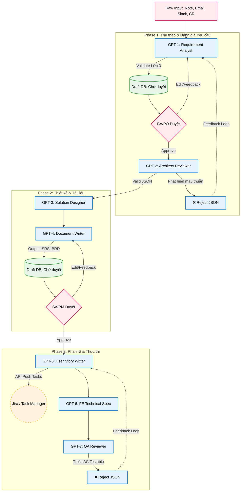

# Sơ đồ Luồng Nền Tảng (Pipeline Flowchart)

Tài liệu này mô tả kiến trúc luân chuyển dữ liệu đa chiều của **MyGPT BA Suite**, bao gồm luồng thực thi chính (Happy Path), chốt chặn phê duyệt của con người (Human-in-the-loop), và vòng lặp phản hồi (Reject Routing).

## 1. Sơ đồ Kiến trúc Tổng thể (Mermaid Diagram)

*Hỗ trợ render trực tiếp trên GitHub, GitLab, Notion, Confluence hoặc các trình biên dịch Markdown có hỗ trợ Mermaid.*

## 2. Diễn giải các luồng cơ bản

### 2.1. Luồng chạy chính (Happy Path)
Tài liệu sẽ di chuyển từ `GPT-1` đến `GPT-9` theo một Pipeline ID duy nhất (ví dụ `intake_id`). JSON Output của tác tử trước đóng vai trò là Context Input hoàn hảo cho tác tử sau.

### 2.2. Human-in-the-loop (Chốt chặn duyệt)
Để chống "Ảo tưởng tự động hóa", hệ thống không chạy một mạch từ GPT-1 xuống GPT-9.
- Các bản nháp được lưu xuống **Draft DB**.
- Tạm dừng Pipeline cho đến khi con người (BA, PO, SA) lên UI để **Approve** (phê duyệt) hoặc **Sửa đổi** (Edit).

### 2.3. Vòng lặp phản hồi (Reject Routing)
Các tác tử đóng vai trò Reviewer (`GPT-2`, `GPT-7`) có khả năng tự suy luận logic. Nếu phát hiện đầu vào bị thiếu, sai hoặc mâu thuẫn với Business Rules, chúng trả về JSON với trạng thái `reject`, thay vì cố gắng sinh tài liệu rác. Dữ liệu này được gửi ngược về Agent làm lỗi để sửa lại hoặc yêu cầu con người can thiệp bổ sung thông tin.