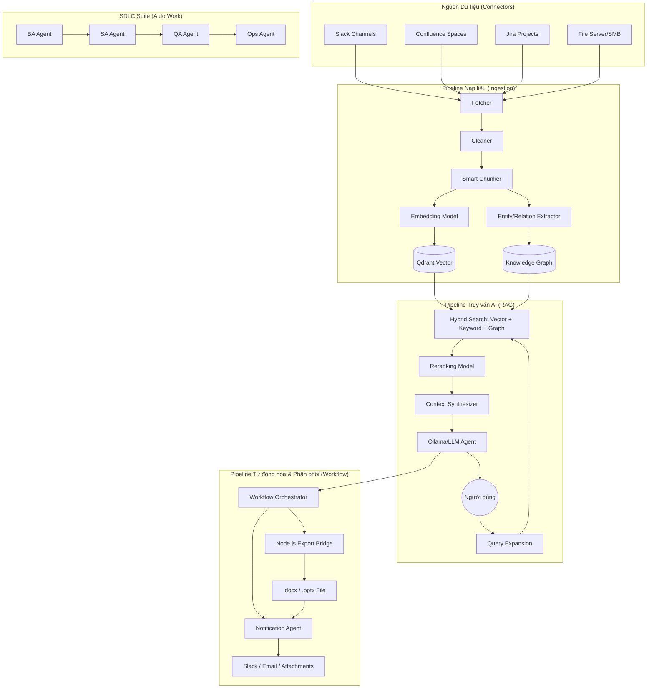

# Tài liệu Kiến trúc & Các Tuyến xử lý (Pipelines) - Knowledge Platform

> [!CAUTION]
> Các tệp tin `.docx` và `.pptx` trong thư mục này đã **lỗi thời**. Vui lòng chỉ tham khảo các tệp tin `.md` cập nhật.

> **Phiên bản:** 2.1 (Hardened) | **Ngày:** 2026-04-03

Tài liệu này cung cấp cái nhìn chi tiết về các luồng xử lý dữ liệu và logic AI cốt lõi của hệ thống, bao gồm cơ chế Nạp liệu, Truy vấn RAG, Trích xuất Tác vụ và Quy trình SDLC đa Agent.

---

## 1. Sơ đồ Kiến trúc Tổng quan

Hệ thống được thiết kế theo kiến trúc **Agentic Service-Oriented**, trong đó các Agent đóng vai trò là các thực thể xử lý thông minh kết nối giữa dữ liệu thô và giá trị nghiệp vụ.

---

## 2. Pipeline 1: Nạp dữ liệu & Đồ thị Tri thức (Ingestion & Graph)

Đây là "hệ tiêu hóa" của hệ thống, biến dữ liệu thô từ nhiều nguồn thành tri thức có cấu trúc.

### Quy trình chi tiết:
1.  **Fetcher**: Sử dụng các Connector chuyên dụng để lấy dữ liệu tăng trưởng (Incremental Sync).
2.  **Cleaner & Metadata Extractor**: Loại bỏ code thừa, HTML rác và trích xuất Metadata (Author, URL, Timestamp).
3.  **Asset Ingestor**: Tự động tải hình ảnh, sơ đồ trong tài liệu. Sử dụng **Multimodal AI** để viết Caption cho ảnh, giúp nội dung ảnh cũng có thể tìm kiếm được bằng văn bản.
4.  **Smart Chunking**: Chia nhỏ tài liệu dựa trên ngữ cảnh (ví dụ: chia theo Section của Confluence) thay vì chia theo số từ máy móc.
5.  **Identity & Relation Mapping**:
    *   **Jira Identity**: Trích xuất `author_email` từ worklogs để khớp chính xác với tài khoản hệ thống thay vì chỉ dùng tên hiển thị.
    *   **Entity Extractor**: Trích xuất các thực thể (Module, Person, Technology).
    *   **Identity Resolver**: Hợp nhất các tên gọi khác nhau về một định danh duy nhất (ví dụ: "RAG System" và "Hệ thống RAG").
    *   **Document Linker**: Tự động tạo liên kết giữa các tài liệu nếu chúng nhắc đến nhau hoặc cùng thực thể.

---

## 3. Pipeline 2: AI RAG & Tìm kiếm Hybrid (Search & Chat)

Pipeline này đảm bảo AI trả lời dựa trên "Ground Truth" (dữ liệu thật) của nội dung dự án.

### Logic xử lý chuyên sâu:
1.  **Query Expansion & Rewriting**: AI phân tích câu hỏi người dùng, bổ sung các từ khóa kỹ thuật và ngữ cảnh ẩn để tăng độ chính xác khi tìm kiếm.
2.  **Multi-Stage Retrieval (Tìm kiếm 3 lớp)**:
    *   **Vector Search**: Tìm kiếm theo ý nghĩa ngữ nghĩa (Semantic).
    *   **Keyword Search (PostgreSQL GIN)**: Sử dụng so khớp chính xác (`=`) thay vì `ILIKE` để tận dụng Index hiệu năng cao trên metadata (project_key, source).
    *   **Graph Retrieval**: Tìm kiếm các tài liệu liên quan thông qua quan hệ đồ thị (ví dụ: "Tìm các tài liệu liên quan đến Module X").
3.  **Reranking**: Sử dụng model Cross-Encoder để chấm điểm lại top 50 kết quả, chỉ lấy ra những đoạn text thực sự liên quan nhất.
4.  **Context Isolation Rules**: Áp dụng quy tắc cô lập nghiêm ngặt trong Prompt để AI không "tự chế" (hallucinate) các quy tắc nghiệp vụ không có trong tài liệu.

---

## 4. Pipeline 3: Trích xuất Tác vụ Tự động (Task Extraction)

Đây là một Agent chạy ngầm chuyên "nghe trộm" các tín hiệu công việc từ Slack/Confluence.

### Cơ chế hoạt động:
-   **Signal Detection**: Một layer AI siêu nhẹ quét qua các tin nhắn để tìm "Tín hiệu hành động" (ví dụ: "Em check log giúp anh", "Need to update API").
-   **Task Extractor**: Khi có tín hiệu, Agent BA Senior sẽ vào cuộc để:
    *   Phân tích ngữ cảnh đoạn nội dung.
    *   Trích xuất: Tiêu đề, Mô tả chi tiết, Độ ưu tiên, Người thực hiện dự kiến.
    *   **Confidence Scoring**: Chỉ những task có độ tự tin > 0.7 và độ dài mô tả > 40 ký tự mới được lưu vào danh sách Draft để tránh rác (Junk tasks).

---

## 5. Pipeline 4: SDLC "Auto Work" Suite (9-Agent Pipeline)

Đây là quy trình phức tạp nhất, mô phỏng một đội dự án phần mềm hoàn chỉnh.

### Danh sách các Agent & Vai trò (Personas):
Hệ thống điều phối 9 Agent chuyên biệt thông qua 9 bước:

1.  **Requirement Analyst**: Chuyển idea thô thành FR/NFR/Assumptions.
2.  **Architect Reviewer**: Tìm xung đột nghiệp vụ, lỗ hổng logic (Gaps/Conflicts).
3.  **Solution Designer**: Thiết kế kiến trúc, ADR (Architecture Decision Records) và Data Model.
4.  **Document Writer (SRS/BRD)**: Soạn thảo văn bản đặc tả theo tiêu chuẩn IEEE/Enterprise.
5.  **User Story Writer**: Viết Story theo INVEST và Gherkin (Given-When-Then).
6.  **FE Technical Spec**: Đặc tả Component tree, State matrix, a11y và Perf budget.
7.  **QA Reviewer**: Thiết kế Test Case 5 cấp độ và Security testing map OWASP.
8.  **Deployment Spec**: Xây dựng luồng CI/CD, Alerting thresholds và Runbook.
9.  **Change & Release Manager**: Phân tích tác động (Impact Analysis) 6 chiều khi có thay đổi.

### Quy tắc "Proactive Questioning":
Trong quá trình xử lý, nếu thông tin đầu vào thiếu, các Agent được yêu cầu không tự ý bịa đặt mà phải đặt câu hỏi ngược lại (TBD placeholders + Clarification Questions) để người dùng bổ sung.

---

## 6. Pipeline 5: Tự động hóa Tài liệu & Phân phối (Export & Notification)

Đây là pipeline mới nhất, giúp hiện thực hóa vai trò "Thư ký ảo" của hệ thống.

### Cơ chế hoạt động:
1.  **Node.js Bridge**: Khi một node Export (`docx_export` hoặc `pptx_export`) được kích hoạt, hệ thống Python sẽ gọi một kịch bản Node.js riêng biệt sử dụng thư viện `docx` hoặc `pptxgenjs`. Việc tách biệt này đảm bảo chất lượng định dạng tài liệu cao nhất (vượt xa các thư viện Python thuần túy).
2.  **Premium CSS Preview**: Hệ thống tạo ra một bản mô phỏng trực quan ngay trên web (Mockup) bằng CSS cho cả khổ giấy A4 và Slide 16:9, giúp người dùng kiểm tra nhanh mà không cần tải file.
3.  **Hệ thống Phân phối (Notification)**:
    *   **Slack**: Gửi trực tiếp vào channel thông qua Bot Token.
    *   **Email (SMTP)**: Gửi báo cáo định kỳ. Nếu trước đó có bước tạo tài liệu, hệ thống sẽ tự động quét và **đính kèm (Attach)** file tệp tin vào email một cách thông minh.
4.  **Scheduled Triggers (Cron)**: Hỗ trợ đặt lịch chạy tự động bằng cú pháp Cron tiêu chuẩn, phù hợp cho các báo cáo định kỳ hàng ngày/hàng tuần.

---

## 7. Gia cố Hiệu năng (Performance Hardening) - Ready for 30 Users

Hệ thống đã được tối ưu hóa để chịu tải 30 người dùng đồng thời (Concurrent Users):

1.  **Database Connection Pool**: Nâng cấp lên `pool_size=30` và `max_overflow=10` để tránh tình trạng treo API khi truy cập Dashboard hàng loạt.
2.  **Performance Indexing**: Bổ sung bộ Index đa cấp trên bảng `documents` cho các cột `source`, `project_key` (metadata parsing) và `source_id`.
3.  **SQL Exact Match**: Chuyển đổi toàn bộ logic truy vấn SQL từ `ILIKE` sang `=` để đảm bảo tận dụng tối đa Index, giảm thời gian phản hồi từ hàng giây xuống hàng miligiây.
4.  **Queue Management**: Giới hạn `ARQ_INGESTION_MAX_JOBS=2` để ưu tiên tài nguyên CPU/LLM cho người dùng Chat, tránh việc nạp liệu làm chậm hệ thống.
5.  **Project-Level Security**: Tích hợp `validate_project_access` vào mọi route, thực hiện lọc dữ liệu ngay từ lớp Database thay vì lọc tại Application layer.

---
*Tài liệu này được cập nhật tự động dựa trên cấu trúc mã nguồn hiện tại.*
